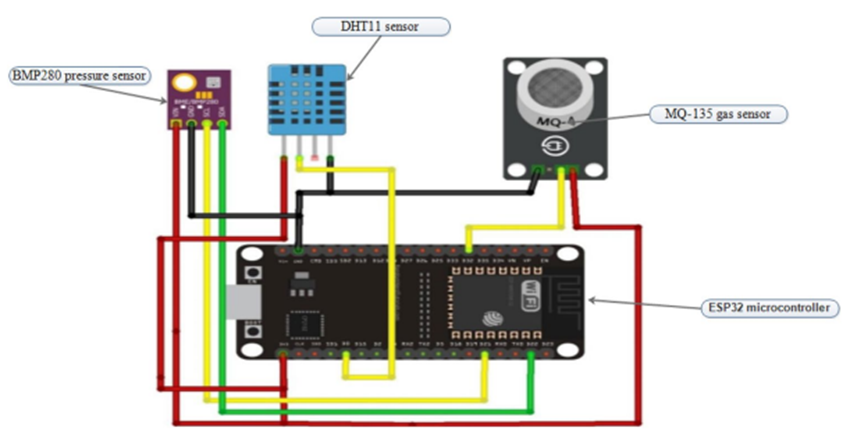
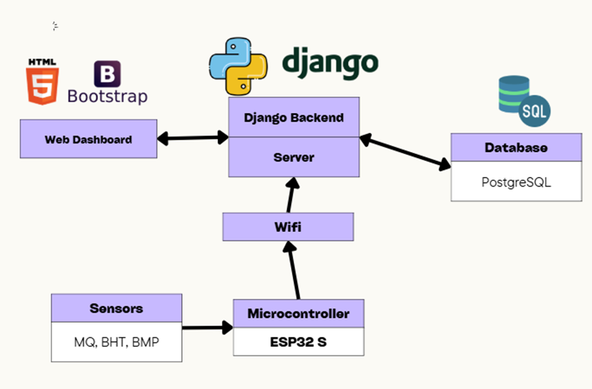
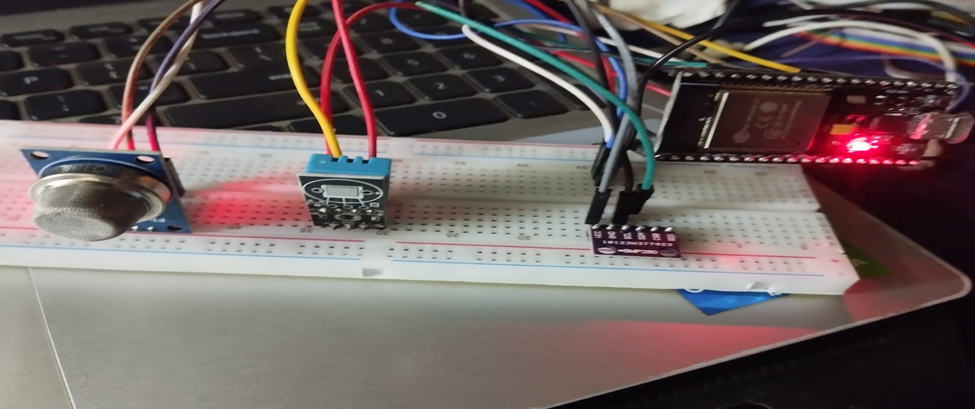
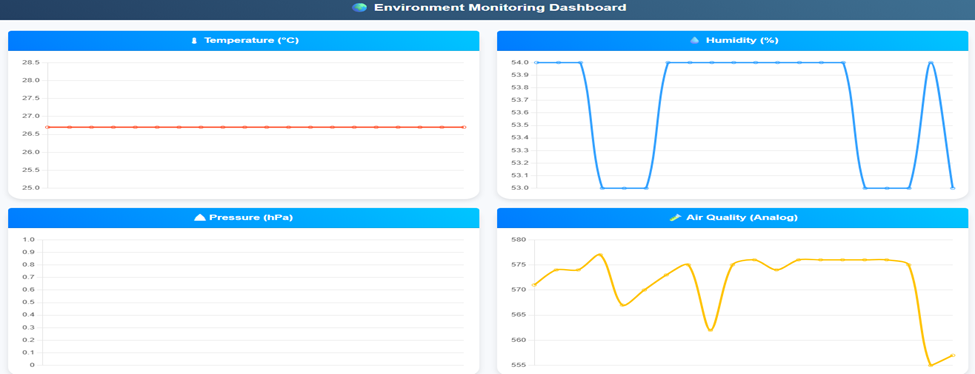
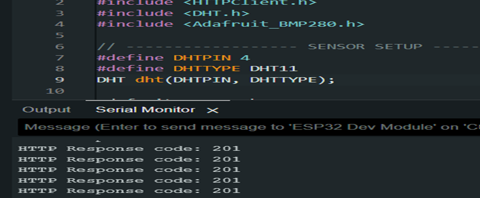
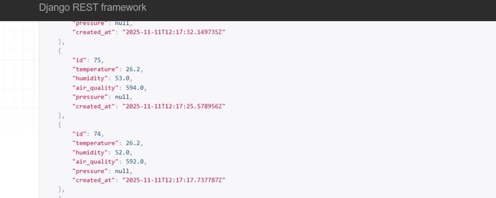

# 🌍 IoT-Based Real-Time Environmental Monitoring System


An **IoT-driven environmental monitoring system.** This project collects real-time **temperature, humidity, air quality, and pressure** data using ESP32 and multiple sensors, then sends it to a **Django backend**, where the data is stored, processed, and visualized through a **web-based dashboard**.

It is designed as a scalable IoT monitoring solution suitable for **smart homes, agriculture, and research-based environmental studies**.

---

## 🔧 Hardware Used

| Component | Purpose                       |
| --------- | ----------------------------- |
| ESP32     | Wi-Fi enabled microcontroller |
| DHT11     | Temperature & Humidity Sensor |
| BMP280    | Atmospheric Pressure Sensor   |
| MQ Sensor | Air Quality / Gas Sensor      |

---

## 💻 Software Used

- Python 3.10+
- Django 5.x
- Django REST Framework
- Chart.js (frontend visualization)
- Arduino IDE / PlatformIO
- SQLite / PostgreSQL
- Virtual Environment (`venv`)

---

## 📂 Project Structure

```
📦 Project Root
 ┣━ env_monitor/          # Django main project
 ┣━ sensors/              # Django app
 ┣━ templates/sensors/    # Dashboard HTML
 ┣━ esp32/                # ESP32 firmware
 ┣━ requirements.txt
 ┣━ manage.py
```

---

## 🚀 How It Works

- 1️⃣ ESP32 reads all sensor values every 5 seconds
- 2️⃣ Converts readings into a JSON payload
- 3️⃣ Sends POST request to Django API endpoint `/api/data/`
- 4️⃣ Django validates & stores data in database
- 5️⃣ Dashboard fetches latest values and generates real‑time charts

---


## 🔌Circuit Diagram

This shows the basic working flow of the system.



---

## 🏗 System Architecture 

This explains how sensors, ESP32, Django API, and dashboard interact.



---


## ⚙️ Installation (Backend)

> Commands assume `git` and `python` are installed.

### 1. Clone the repo
```
git clone https://github.com/YOUR_USERNAME/iot-environment-monitoring.git
cd iot-environment-monitoring/env_monitor
```
### 2. Create virtual environment
``` python -m venv .venv ```
### Activate venv:

``` 
# Windows
.venv\Scripts\activate 
```

```
# macOS/Linux 
source .venv/bin/activate
```

### 3. Install dependencies
``` pip install -r requirements.txt ```

### 4. Apply migrations
``` python manage.py migrate ```

### 5. Run server
```python manage.py runserver 0.0.0.0:8000 ```

Open ``` http://localhost:8000/ (or http://YOUR_PC_IP:8000/) ``` to view the dashboard.

---

## 📁 ESP32 Firmware

Located inside:

```
esp32/esp32_env_monitor.ino
```

This code sends sensor readings as JSON to Django API.

---


## 📡 API Endpoint

```
POST http://your-ip:8000/api/data/
```

---

## 🖥️ Dashboard Preview

- Real-time charts (temperature, humidity, pressure, air quality)

- Null-value safe

- Latest 20 readings visible

- Interactive and responsive design

---


## 📊 Results

* Successfully collects live environmental data
* Data visible in interactive web dashboard
* System Works even if a sensor reading is broken/missing


### 🔌 ESP32 + Sensor Hardware Setup

Real physical connection of ESP32 with DHT11, MQ sensor, and BMP280.



---

### 📊 Real-Time Web Dashboard

Live environment readings displayed via Django + Chart.js



---

### 🟢 Successful Data Upload (HTTP 201)

Captured from ESP32 serial monitor confirming successful POST request.



---

### 🌍 Django REST API Receiving Sensor Data

This screenshot shows JSON data arriving at Django REST API.




---

## 🌱 Future Improvements

- Add ML models for prediction & anomaly detection (LSTM/XGBoost)
- Add radiation sensor (for research near Nuclear Plant)
- Add alerting (email/SMS) for threshold breaches
- Deploy backend on cloud (AWS / Railway / PythonAnywhere)
- Store data in TimescaleDB for long‑term analysis
- Build mobile app to monitor live readings

---

## 👨‍💻 Developed By

**Md Mahfuz Hossain**  
Backend Developer | Django Enthusiast  
Department of ICE, BAUET  
[GitHub](https://github.com/mdmahfuzbipu) | [LinkedIn](https://www.linkedin.com/in/muhammadmahfuzhossain/)  
📅 November 2025

---

## ⭐ Contribution

Pull requests are welcome! Feel free to fork & improve.

---

## 🛡 License

This project is released under the **MIT License**.
